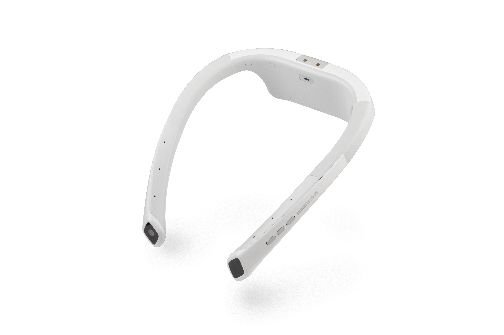
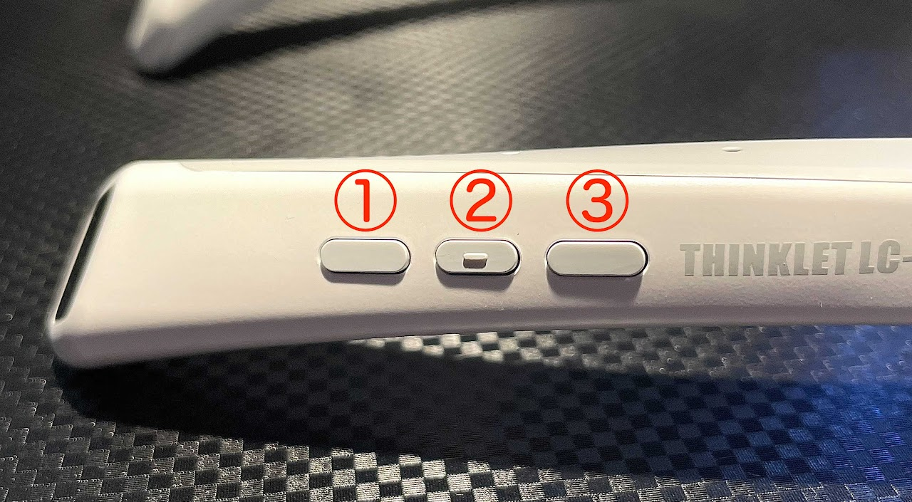
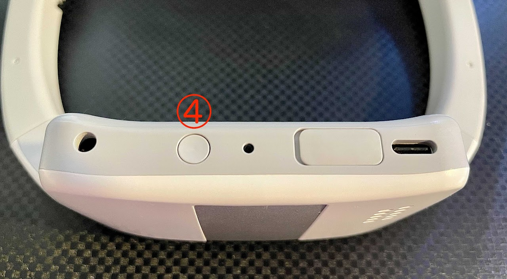
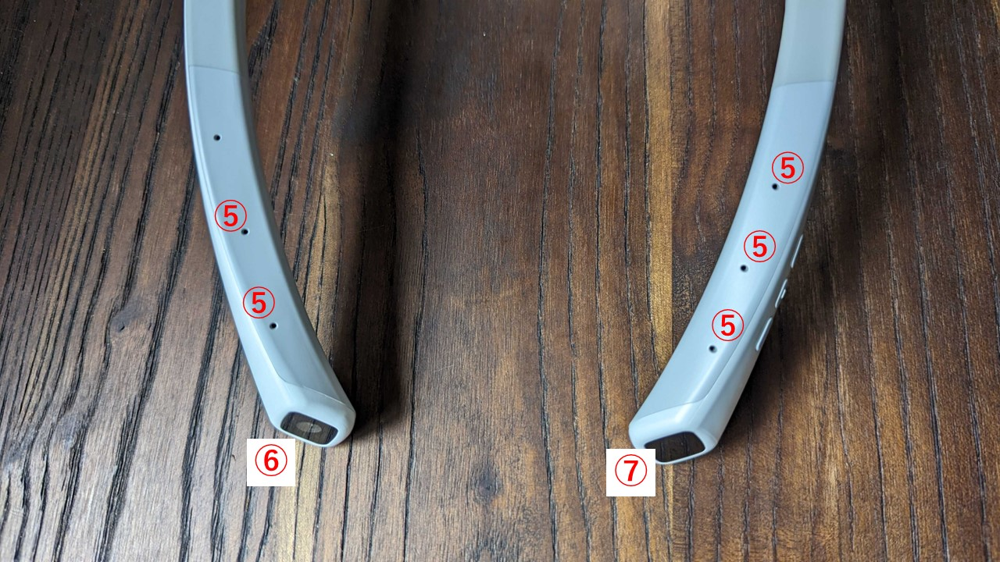

---
tags:
  - THINKLET
  - Android
---

# はじめに
## 前提として
- THINKLETアプリ開発には、Android Studioとそれを動作させるPCが必要です。
- THINKLETアプリ開発には、`adb` 接続が必須です。
  - THINKLETは、デフォルトでは、`adb`が有効な状態で提供されます。
  - `adb` を無効にすることで、第三者による新規のアプリインストールを抑制できます。しかし、操作ができない、開発者画面が表示できないなどのデメリットも発生します。  

  :::danger
  **THINKLETの開発者モードを無効にする際は十分にそのリスクを理解してください。**
    - 参考1: [developer.android.com #Adbについて](https://developer.android.com/studio/command-line/adb)
    - 参考2: [Adb 有効無効 切り替え機能](https://github.com/FairyDevicesRD/thinklet.app.sdk#%E9%96%8B%E7%99%BA%E8%80%85%E3%83%A2%E3%83%BC%E3%83%89)
  :::

- 事前に、PCの要求スペックについては、[developer.android.com #install](https://developer.android.com/studio/install?hl=ja) をご確認ください。
- また、本ドキュメントでは、`adb` コマンドを多用します。
  - `adb` コマンドは、WindowsならPowershellや、コマンドプロンプト、MacやLinuxならばターミナルから実行します。
  - `adb` コマンド自体は、途中でセットアップします。
  - 現時点では、Powershellやターミナルの起動の方法をご確認ください。
- なお、[LINKLET](https://linklet.ai/) としてご利用頂いているTHINKLETは、開発機としてはご利用できません。

## THINKLETとは


[THINKLET](https://mimi.fairydevices.jp/technology/device/thinklet/)は、Fairy Devicesが開発したLTE/Wi-Fi搭載の首掛け型ウェアラブルデバイスです。  
5つのマイクと1つの広角カメラ、各種センサーを内蔵、  
人間工学に基づいた軽量型首掛け型デザインで、装着者の邪魔にならず、ハンズフリーでの作業を支援します。  
5つのマイクと、[XFE技術](https://mimi.fairydevices.jp/technology/edge/xfe/)により、建設現場等の高騒音環境下でも、人の声だけを取り出し高い音声認識率を実現します。  
また、肩掛けの位置に装着されるため、視線カメラと比較して大幅に動画像の撮影が安定します。  
OSには、AOSP(Android Open Source Project) をベースとしたFairy OSを開発し、Androidアプリと互換性があります。

## ハードウェア仕様
- THINKLETに組み込まれているボタンなどの位置について説明します。
  - [参考: developer.android.com #KeyEvent](https://developer.android.com/reference/android/view/KeyEvent)

```
(1) KEYCODE_VOLUME_DOWN がアサインされたボタン
(2) KEYCODE_CAMERA がアサインされたボタン
(3) KEYCODE_VOLUME_UP がアサインされたボタン
(4) KEYCODE_POWER がアサインされたボタン。常に短押しでHomeに戻る動作をします
(5) 5つのマイク
(6) 広角カメラ
(7) ジェスチャーセンサー（ハンドジェスチャー用）

補足：
- KEYCODE_VOLUME_DOWN は、Androidでは音量を下げるキーイベントを指します。
- KEYCODE_VOLUME_UP は、Androidでは音量を上げるキーイベントを指します。
- KEYCODE_CAMERA は、Androidではカメラキーイベントを指します。
- KEYCODE_POWER は、Androidでは電源ボタンのキーイベントを指します。
```




