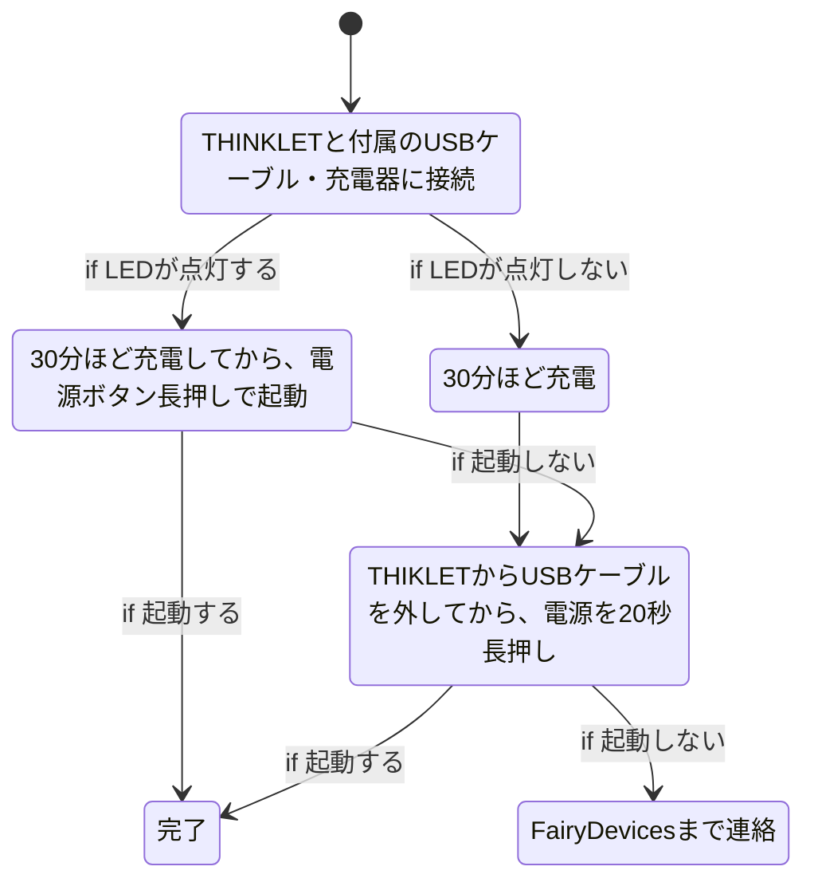
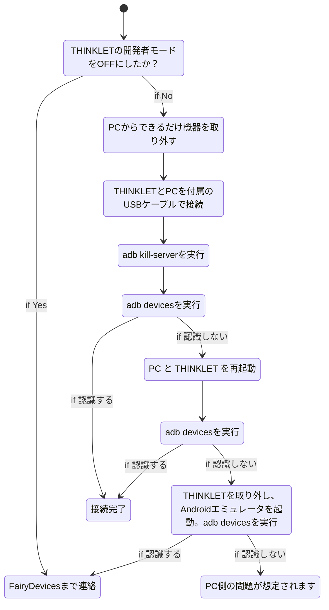

---
tags:
  - THINKLET
  - Android
  - adb
---

# トラブルシューティング
ここでは、THINKLETの開発時・利用時に発生するトラブルへの対処法をまとめています。

## 電源がつかない
以下のフローで試してみてください。  
バッテリーが少ない、デバイスがハングアップしているケースがあります。

## Adb接続ができない
開発者モードをOFFにしてしまい、復旧できないケースは弊社までご連絡ください。  
開発者モードはONであるが、機器の再起動、不要な機器の切断をした上で、  
エミュレータや他のAndroidデバイスでは問題がない場合も弊社までご連絡ください。

